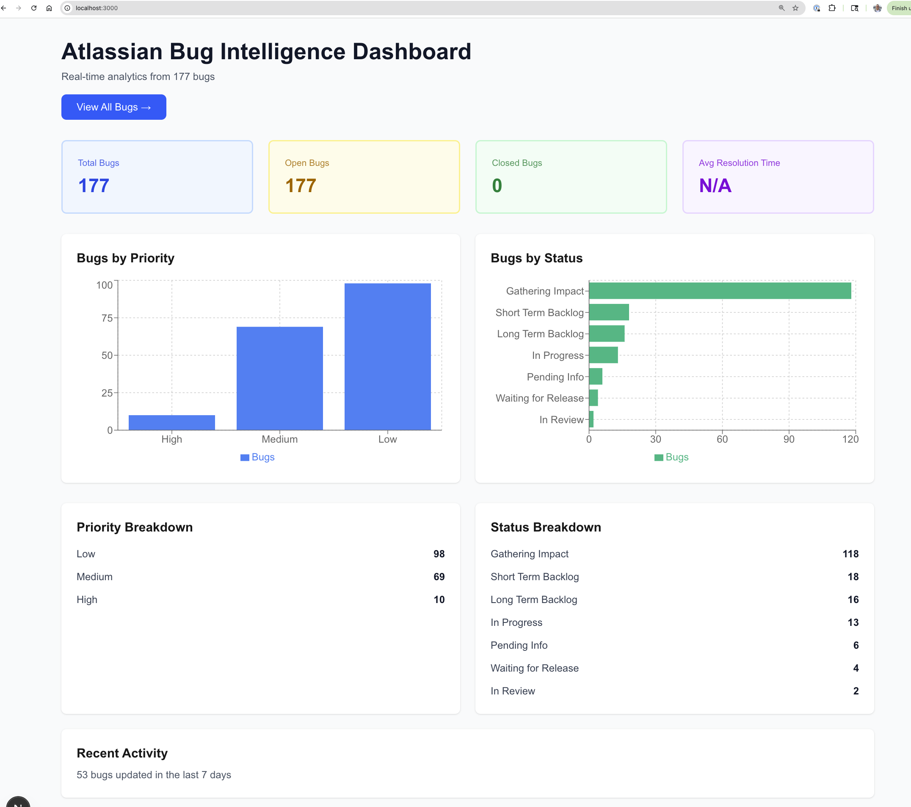

# Atlassian Bug Intelligence Dashboard

A full-stack analytics platform that transforms Atlassian's public bug data into actionable insights. Built in a weekend to demonstrate modern full-stack development with real-world data.



## 🚀 Live Demo

- **Frontend**: https://atlassian-bug-dashboard.vercel.app/ 
- **API Docs**: [Coming soon]

## ✨ Features

- **AI-Powered Triage**: Automatic ticket classification using Claude Haiku - categorizes bugs by type, priority, urgency, and team assignment
- **Real-time Analytics**: Integrated with Atlassian Jira API to sync and visualize open cloud migration bugs with interactive charts and advanced search capabilities
- **Interactive Charts**: Priority and status distribution visualizations
- **Searchable Bug List**: Filter by status, priority, or search terms
- **Paginated Results**: Browse through all bugs efficiently
- **Direct Links**: Click any bug to view it on Atlassian's Jira

## 🤖 AI Triage

The dashboard uses Claude Haiku to automatically analyze and triage bug tickets. Each bug is assessed for:

| Field | Description |
|-------|-------------|
| **Category** | bug, feature_request, security, performance, documentation, etc. |
| **Priority** | critical, high, medium, low |
| **Urgency** | immediate, soon, normal, backlog |
| **Team** | frontend, backend, infrastructure, security, data, etc. |
| **Tags** | Auto-generated relevant tags |
| **Confidence** | AI confidence score (0-100%) |
| **Reasoning** | Brief explanation of the triage decision |

### Usage
- **Auto-triage on sync**: New bugs are automatically triaged when syncing from Jira
- **Manual triage**: Click the "Triage" button on any bug to trigger analysis
- **Re-triage**: Click any triaged bug row to expand details and re-triage if needed

## 🛠️ Tech Stack

### Backend
- **Python 3.11** - Core language
- **FastAPI** - Modern, fast web framework
- **PostgreSQL** - Database
- **SQLAlchemy** - ORM
- **Pydantic** - Data validation

### Frontend
- **Next.js 15** - React framework
- **TypeScript** - Type safety
- **Tailwind CSS** - Styling
- **Recharts** - Data visualization
- **Axios** - API client

### Infrastructure
- **Docker** - PostgreSQL container
- **Poetry** - Python dependency management

## 📊 Dashboard Preview

### Overview
- Total bugs count
- Open vs closed breakdown
- Average resolution time
- Priority distribution chart
- Status distribution chart

### Bug List
- Searchable by summary
- Filterable by status and priority
- Sortable columns
- Pagination
- Direct links to Jira tickets

## 🏃‍♂️ Quick Start

### Prerequisites
- Python 3.11+ (via pyenv)
- Node.js 20+ (via nvm)
- Docker Desktop
- Poetry

### Backend Setup
```bash
# Start PostgreSQL
cd ~/atlassian-bug-dashboard
docker-compose up -d postgres

# Install dependencies
cd backend
poetry install --no-root

# Initialize database
poetry run python scripts/init_db.py

# Start API server
poetry run uvicorn app.main:app --reload
```

### Frontend Setup
```bash
# Install dependencies
cd ~/my-analytics-app
npm install

# Start dev server
npm run dev
```

### Environment Variables
```bash
# Required for AI triage (get from console.anthropic.com)
export ANTHROPIC_API_KEY="sk-ant-..."
```

### Load Data
```bash
# Sync bugs from Atlassian Jira (with auto-triage)
curl -X POST "http://localhost:8000/api/bugs/sync?auto_triage=true"

# Sync without triage
curl -X POST "http://localhost:8000/api/bugs/sync?auto_triage=false"
```

Visit http://localhost:3000 to see the dashboard!

## 📁 Project Structure
```
├── backend/
│   ├── app/
│   │   ├── api/routes/      # API endpoints
│   │   ├── core/            # Config & database
│   │   ├── models/          # SQLAlchemy models
│   │   ├── schemas/         # Pydantic schemas
│   │   └── services/        # Jira client
│   └── scripts/             # DB initialization
│
├── src/
│   ├── app/
│   │   ├── page.tsx         # Dashboard
│   │   └── bugs/page.tsx    # Bug list
│   ├── components/charts/   # Chart components
│   └── lib/api.ts           # API client
```

## 🔌 API Endpoints

| Method | Endpoint | Description |
|--------|----------|-------------|
| GET | `/api/health` | Health check |
| GET | `/api/bugs` | List bugs (paginated) |
| GET | `/api/bugs/{key}` | Get bug details |
| POST | `/api/bugs/sync` | Sync from Jira (with auto-triage) |
| POST | `/api/bugs/{key}/triage` | Manually triage a bug |
| GET | `/api/bugs/triage/status` | Triage statistics |
| GET | `/api/analytics/overview` | Dashboard stats |
| GET | `/api/analytics/trends` | Trend data |

## 🎯 Why I Built This

As a Product Operations leader, I've spent years translating operational signals into executive decisions. This project demonstrates:

- **Full-stack development** - Backend API + Frontend dashboard
- **Data engineering** - ETL from external APIs
- **Product thinking** - Metrics that matter
- **Modern tech stack** - Industry-standard tools

## 🚧 Roadmap

- [x] Deploy to Vercel/Railway
- [x] Add Claude API for AI-powered insights
- [ ] Add trend charts over time
- [ ] Implement Prefect for scheduled syncs
- [ ] Export to Tableau (.hyper files)
- [ ] Filter bugs by AI triage category/team

## 👤 Author

**James Bringetto**
- LinkedIn: [Connect with me](https://linkedin.com/in/jamesbringetto)
- GitHub: [@jamesbringetto](https://github.com/jamesbringetto)

## 📄 License

MIT License - feel free to use this as inspiration for your own projects!

---

Built with ☕ and Claude in a weekend.
